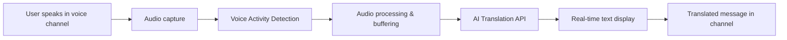

# Discord AI-Powered Multilingual Translation Bot 🌍

<div align="center">

**Break language barriers in real-time with AI-powered voice translation**

A powerful Discord bot that provides seamless real-time voice translation using advanced AI (Google Gemini API). Join any voice channel and experience automatic speech translation across 50+ languages, making global communication effortless.

[](LICENSE)
[](https://nodejs.org/)
[](https://www.typescriptlang.org/)
[](https://discord.js.org/)

</div>

## ✨ Features

- 🎙️ **Real-time Voice Translation**: Automatically translates speech as users speak in voice channels with minimal latency
- 🌐 **Extensive Multilingual Support**: Supports 50+ languages powered by Google Gemini AI and compatible with OpenAI/DeepL
- 🔍 **Intelligent Auto Language Detection**: Automatically detects the source language without manual configuration
- 🎯 **Smart Voice Activity Detection**: Only processes audio when someone is speaking, optimizing performance and API usage
- ⚡ **High Performance**: Efficient audio processing with buffering and optimized API calls
- 🛡️ **Test-Driven Development**: Built with comprehensive test coverage using Jest for reliability
- 🔧 **Easy Configuration**: Simple setup with environment variables and slash commands
- 📊 **Real-time Status**: Monitor translation status and current settings with built-in commands

## 🌍 Supported Languages

### Major Languages

| Language | Native Name | Code | Flag |
|----------|-------------|------|------|
| Japanese | 日本語 | `ja` | 🇯🇵 |
| English | English | `en` | 🇺🇸 |
| Chinese (Simplified) | 简体中文 | `zh` | 🇨🇳 |
| Chinese (Traditional) | 繁體中文 | `zh-TW` | 🇹🇼 |
| Spanish | Español | `es` | 🇪🇸 |
| French | Français | `fr` | 🇫🇷 |
| German | Deutsch | `de` | 🇩🇪 |
| Korean | 한국어 | `ko` | 🇰🇷 |
| Arabic | العربية | `ar` | 🇸🇦 |
| Hindi | हिन्दी | `hi` | 🇮🇳 |
| Portuguese | Português | `pt` | 🇵🇹 |
| Russian | Русский | `ru` | 🇷🇺 |

### European Languages

| Language | Native Name | Code | Flag |
|----------|-------------|------|------|
| Italian | Italiano | `it` | 🇮🇹 |
| Dutch | Nederlands | `nl` | 🇳🇱 |
| Polish | Polski | `pl` | 🇵🇱 |
| Ukrainian | Українська | `uk` | 🇺🇦 |
| Czech | Čeština | `cs` | 🇨🇿 |
| Swedish | Svenska | `sv` | 🇸🇪 |
| Danish | Dansk | `da` | 🇩🇰 |
| Norwegian | Norsk | `no` | 🇳🇴 |
| Finnish | Suomi | `fi` | 🇫🇮 |
| Greek | Ελληνικά | `el` | 🇬🇷 |
| Romanian | Română | `ro` | 🇷🇴 |
| Hungarian | Magyar | `hu` | 🇭🇺 |
| Turkish | Türkçe | `tr` | 🇹🇷 |
| Bulgarian | Български | `bg` | 🇧🇬 |
| Croatian | Hrvatski | `hr` | 🇭🇷 |
| Slovak | Slovenčina | `sk` | 🇸🇰 |

### Asian Languages

| Language | Native Name | Code | Flag |
|----------|-------------|------|------|
| Thai | ไทย | `th` | 🇹🇭 |
| Vietnamese | Tiếng Việt | `vi` | 🇻🇳 |
| Indonesian | Bahasa Indonesia | `id` | 🇮🇩 |
| Malay | Bahasa Melayu | `ms` | 🇲🇾 |
| Filipino | Filipino | `fil` | 🇵🇭 |
| Bengali | বাংলা | `bn` | 🇧🇩 |
| Urdu | اردو | `ur` | 🇵🇰 |
| Tamil | தமிழ் | `ta` | 🇮🇳 |
| Telugu | తెలుగు | `te` | 🇮🇳 |
| Marathi | मराठी | `mr` | 🇮🇳 |
| Gujarati | ગુજરાતી | `gu` | 🇮🇳 |
| Kannada | ಕನ್ನಡ | `kn` | 🇮🇳 |
| Punjabi | ਪੰਜਾਬੀ | `pa` | 🇮🇳 |
| Burmese | မြန်မာဘာသာ | `my` | 🇲🇲 |
| Khmer | ខ្មែរ | `km` | 🇰🇭 |
| Lao | ລາວ | `lo` | 🇱🇦 |
| Nepali | नेपाली | `ne` | 🇳🇵 |
| Sinhala | සිංහල | `si` | 🇱🇰 |

### Middle Eastern & African Languages

| Language | Native Name | Code | Flag |
|----------|-------------|------|------|
| Hebrew | עברית | `he` | 🇮🇱 |
| Persian | فارسی | `fa` | 🇮🇷 |
| Swahili | Kiswahili | `sw` | 🇰🇪 |
| Amharic | አማርኛ | `am` | 🇪🇹 |
| Hausa | Hausa | `ha` | 🇳🇬 |
| Yoruba | Yorùbá | `yo` | 🇳🇬 |
| Zulu | isiZulu | `zu` | 🇿🇦 |

### Other Languages

| Language | Native Name | Code | Flag |
|----------|-------------|------|------|
| Catalan | Català | `ca` | 🇪🇸 |
| Basque | Euskara | `eu` | 🇪🇸 |
| Galician | Galego | `gl` | 🇪🇸 |
| Serbian | Српски | `sr` | 🇷🇸 |
| Slovenian | Slovenščina | `sl` | 🇸🇮 |
| Lithuanian | Lietuvių | `lt` | 🇱🇹 |
| Latvian | Latviešu | `lv` | 🇱🇻 |
| Estonian | Eesti | `et` | 🇪🇪 |
| Icelandic | Íslenska | `is` | 🇮🇸 |
| Afrikaans | Afrikaans | `af` | 🇿🇦 |

**Total: 60+ languages and growing!** 🚀

> **Note**: Language support depends on your chosen AI provider:
> - **Google Gemini**: Supports 100+ languages
> - **OpenAI GPT**: Supports 50+ major languages
> - **DeepL**: Supports 30+ languages with exceptional quality
>
> The bot automatically adapts to the capabilities of your configured translation provider.

## 🎯 Use Cases

Perfect for various scenarios:

- 🎮 **International Gaming Communities**: Play with friends worldwide without language barriers
- 💼 **Remote Teams**: Multilingual team meetings and collaboration
- 🎓 **Educational Settings**: Language learning and international classrooms
- 🌐 **Content Creators**: Stream to global audiences with real-time translation
- 👥 **Community Events**: Host inclusive events for diverse communities
- 🤝 **Cultural Exchange**: Connect people from different countries seamlessly

## 📋 Prerequisites

- Node.js 18 or higher
- Discord Bot Token
- Google Gemini API Key
- FFmpeg (for audio processing)

## Installation

1. Clone the repository:
```bash
git clone https://github.com/lifegence/discord-aitranslate-bot.git
cd discord-aitranslate-bot
```

2. Install dependencies:
```bash
npm install
```

3. Install FFmpeg:

**Ubuntu/Debian:**
```bash
sudo apt-get install ffmpeg
```

**macOS:**
```bash
brew install ffmpeg
```

**Windows:**
Download from [ffmpeg.org](https://ffmpeg.org/download.html)

4. Copy `.env.example` to `.env` and configure:
```bash
cp .env.example .env
```

5. Edit `.env` with your credentials:
```env
DISCORD_BOT_TOKEN=your_discord_bot_token_here
DISCORD_CLIENT_ID=your_discord_client_id_here
GOOGLE_GEMINI_API_KEY=your_gemini_api_key_here
DEFAULT_TARGET_LANGUAGE=ja
```

## Getting API Keys

### Discord Bot Token

1. Go to [Discord Developer Portal](https://discord.com/developers/applications)
2. Create a new application
3. Go to "Bot" section and create a bot
4. Copy the bot token
5. Enable these Privileged Gateway Intents:
   - Server Members Intent
   - Message Content Intent

### Invite URL

Use this URL format to invite the bot (replace CLIENT_ID):
```
https://discord.com/api/oauth2/authorize?client_id=CLIENT_ID&permissions=3164160&scope=bot%20applications.commands
```

Required permissions:
- View Channels
- Send Messages
- Connect to Voice
- Speak

### Google Gemini API Key

1. Go to [Google AI Studio](https://makersuite.google.com/app/apikey)
2. Sign in with your Google account
3. Create a new API key
4. Copy the API key

## Usage

### Build the Project

```bash
npm run build
```

### Deploy Commands to Discord

Before first use, deploy the slash commands:
```bash
npm run deploy-commands
```

### Start the Bot

**Production (with scripts):**

Start the bot in background:
```bash
./start-bot.sh
```

Stop the bot:
```bash
./stop-bot.sh
```

View logs:
```bash
tail -f bot.log
```

**Manual start:**

```bash
npm start
```

For development with auto-reload:
```bash
npm run dev
```

### Discord Commands

#### `/translate-join [language]`
Join your current voice channel and start translating.
- `language` (optional): Target language for translation (default: Japanese)

Example:
```
/translate-join language:en
```

#### `/translate-leave`
Leave the voice channel and stop translation.

Example:
```
/translate-leave
```

#### `/translate-language <language>`
Change the target language for translation.
- `language` (required): New target language

Example:
```
/translate-language language:ko
```

#### `/translate-status`
Check the current translation status.

Example:
```
/translate-status
```

## Development

### Run Tests

```bash
npm test
```

Run tests in watch mode:
```bash
npm run test:watch
```

Generate coverage report:
```bash
npm run test:coverage
```

### Project Structure

```
src/
├── bot/               # Discord bot components
│   ├── commands.ts    # Slash command definitions
│   └── command-handler.ts  # Command handlers
├── translation/       # Translation components
│   ├── gemini-client.ts    # Gemini API client
│   └── translation-pipeline.ts  # Translation orchestration
├── voice/             # Voice processing components
│   ├── voice-manager.ts    # Voice connection management
│   └── audio-processor.ts  # Audio processing
├── types/             # TypeScript type definitions
│   └── index.ts
├── utils/             # Utility functions
│   ├── logger.ts      # Logging
│   └── config.ts      # Configuration
├── index.ts           # Main entry point
└── deploy-commands.ts # Command deployment script

tests/
├── unit/              # Unit tests
│   ├── translation/
│   ├── voice/
│   └── utils/
└── integration/       # Integration tests
```

### Architecture

The bot is built using a modular architecture with clear separation of concerns:

1. **VoiceManager**: Manages Discord voice connections and audio streams
2. **AudioProcessor**: Processes audio data (Opus decoding, resampling, VAD)
3. **GeminiClient**: Interfaces with Google Gemini API for translation
4. **TranslationPipeline**: Orchestrates the translation workflow
5. **CommandHandler**: Handles Discord slash commands

### Configuration

All configuration is done through environment variables:

| Variable | Description | Default |
|----------|-------------|---------|
| `DISCORD_BOT_TOKEN` | Discord bot token | Required |
| `DISCORD_CLIENT_ID` | Discord client ID | Required |
| `GOOGLE_GEMINI_API_KEY` | Gemini API key | Required |
| `DEFAULT_TARGET_LANGUAGE` | Default translation target | `ja` |
| `LOG_LEVEL` | Logging level | `info` |
| `AUDIO_CHUNK_SIZE_MS` | Audio chunk size in ms | `30000` |
| `VAD_ENABLED` | Voice activity detection | `true` |
| `GEMINI_MODEL` | Gemini model to use | `gemini-2.0-flash-exp` |

## 🎬 How It Works



### Step-by-Step Process

1. 🎤 **Join Voice Channel**: User runs `/translate-join` command in Discord
2. 🔌 **Connection**: Bot connects to the user's voice channel
3. 🎙️ **Audio Capture**: Bot receives real-time audio streams from all speaking users
4. 🔊 **Smart Detection**: Voice Activity Detection (VAD) identifies when speech occurs
5. 🎵 **Processing**: Audio is accumulated while the user speaks, then processed as a complete speech unit
6. 🤖 **AI Translation**: Complete speech is sent to AI API for simultaneous transcription and translation
7. 💬 **Display**: Translations appear in the text channel with clean, simple formatting:

   ```
   **Username**: Hello, how are you?
   ```

### ⚡ Performance Features

- **Complete Speech Processing**: Processes entire utterances for accurate, context-aware translations
- **Parallel Processing**: Multiple speakers handled simultaneously
- **Smart Buffering**: Accumulates audio data until user finishes speaking for better translation quality
- **Efficient Audio Pipeline**: Minimal CPU usage with optimized audio processing

## Troubleshooting

### Bot doesn't respond to commands
- Make sure commands are deployed: `npm run deploy-commands`
- Check bot permissions in Discord server
- Verify bot token is correct in `.env`

### No audio is being processed
- Check FFmpeg is installed: `ffmpeg -version`
- Verify bot has "Connect" and "Speak" permissions
- Check Voice Activity Detection settings in `.env`

### Translation errors
- Verify Gemini API key is valid
- Check internet connection
- Review logs for specific error messages

## Contributing

Contributions are welcome! Please follow these steps:

1. Fork the repository
2. Create a feature branch
3. Write tests for new features
4. Ensure all tests pass
5. Submit a pull request

## License

MIT License - see LICENSE file for details

## Acknowledgments

- Built with [discord.js](https://discord.js.org/)
- Translation powered by [Google Gemini API](https://ai.google.dev/)
- Audio processing with [prism-media](https://github.com/amishshah/prism-media)

## Support

For issues and questions:
- Open an issue on GitHub
- Check existing issues for solutions
- Review logs with `LOG_LEVEL=debug`
